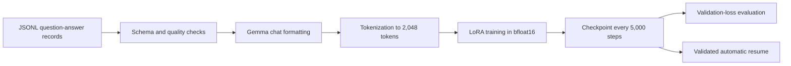
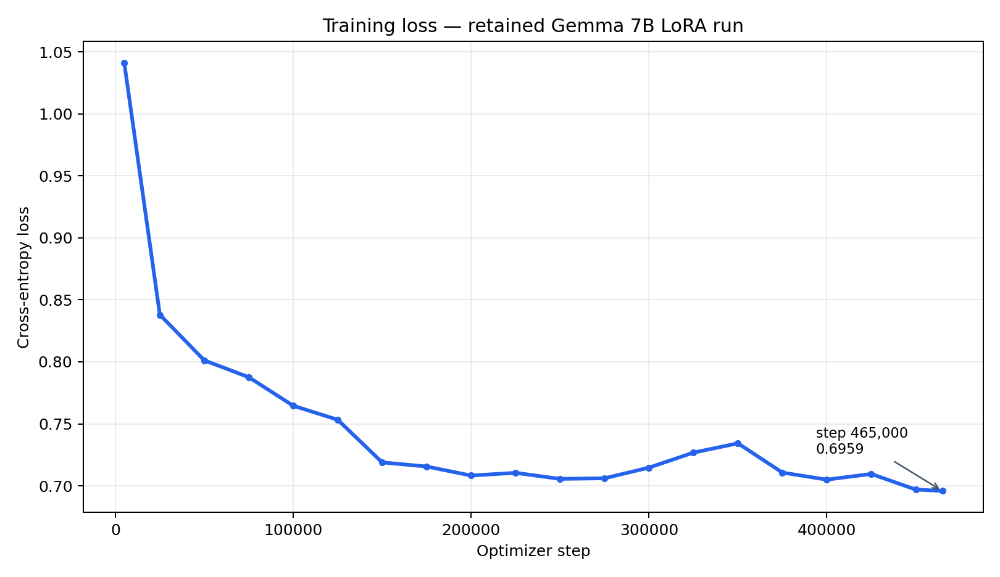
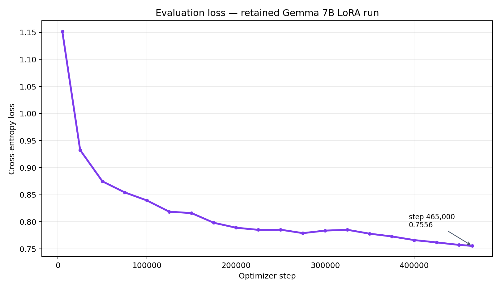

# Case study: recoverable cybersecurity LoRA fine-tuning

## Executive summary

I built a parameter-efficient fine-tuning pipeline for a cybersecurity instruction model and ran it across a multi-million-record corpus. The executed run used `google/gemma-7b-it`, LoRA adapters, bfloat16, gradient checkpointing, and a 2,048-token sequence limit. It reached step 465,000 of 503,729 before repeated facility power interruptions stopped the experiment.

The model is not represented as complete. The engineering outcome is a recoverable training system, evidence-backed learning curves, and a concrete resilience redesign.

## Problem

Cybersecurity guidance spans control requirements, implementation practices, software weaknesses, adversary behaviors, and documentation conventions. The project explored whether an instruction-tuned model could be adapted to that vocabulary without the cost of updating every base-model parameter.

Constraints included a single-GPU training allocation, a long-running job, large JSONL inputs, and an unreliable home power environment.

## Executed configuration

The saved adapter and trainer state—not earlier planning documents—are the source of truth.

| Parameter | Executed value |
|---|---|
| Base model | `google/gemma-7b-it` |
| Method | LoRA / causal language modeling |
| LoRA rank / alpha / dropout | 16 / 32 / 0.05 |
| Target modules | q, k, v, o, gate, up, and down projections |
| Precision | bfloat16 |
| Per-device batch | 2 |
| Gradient accumulation | 4 |
| Effective batch | 8 samples per optimizer update |
| Learning rate | 2e-5 with cosine schedule and 3% warmup |
| Maximum sequence length | 2,048 tokens |
| Checkpoint / evaluation interval | 5,000 steps |
| Planned run | one epoch, 503,729 optimizer steps |

Earlier design notes proposed Gemma 9B and different hyperparameters. Those values are not claimed as executed results because the retained adapter configuration identifies Gemma 7B.

## Pipeline

The public implementation removes machine-specific paths and GPU indices. [`src/training/train_lora.py`](../src/training/train_lora.py) is configuration driven; [`src/training/checkpoints.py`](../src/training/checkpoints.py) rejects incomplete state and finds the newest valid checkpoint.

## Results

At the retained checkpoint:

- Global step: **465,000**
- Planned maximum: **503,729**
- Epoch progress: **0.9231**
- Remaining steps: **38,729**
- Training loss: **1.0411 at step 5,000 → 0.6959 at step 465,000**
- Evaluation loss: **1.1516 at step 5,000 → 0.7556 at step 465,000**
- Full validation runtime at step 465,000: **34,271.6 seconds (about 9.5 hours)**
- Seeded 5,000-record validation runtime: **341.9 seconds**

Reducing routine validation from 503,728 records to a seeded 5,000-record subset reduced measured wall time by approximately **100.2×** while preserving nearly identical processing rate (14.698 versus 14.623 samples/second). This is a scope reduction, not an inference-engine speedup. The decreasing losses show optimization progress, not operational cybersecurity competence. A held-out task suite, factuality review, safety testing, and baseline comparison are still required.

## Failure and recovery analysis

The final checkpoint includes adapter weights, tokenizer assets, optimizer state, scheduler state, RNG state, training arguments, and trainer state. That is sufficient evidence for a full-state resume rather than a weights-only restart.

The original 5,000-step checkpoint interval limited data loss but still exposed a material recovery window. The revised example configuration saves every 2,000 steps and validates a checkpoint before resuming. For a future run I would also:

1. Measure full-system power and add a correctly sized managed UPS.
2. Trigger an orderly shutdown before battery exhaustion.
3. copy completed checkpoints to protected off-host storage and verify SHA-256 manifests.
4. Run fast validation on a fixed subset during training and reserve the nine-hour full validation for milestone gates.
5. Alert on stalled step counters, NaN loss, disk exhaustion, and checkpoint-copy failures.

## What I would evaluate before calling the model complete

- Base model versus adapter on the same held-out prompts
- Exact-answer or rubric-scored control-identification tasks
- Citation and source-attribution accuracy
- Hallucination behavior when evidence is absent
- Unsafe or overconfident security recommendations
- Memorization and near-duplicate leakage across splits
- Latency, throughput, VRAM, and stability after serving the adapter

## Portfolio takeaway

The strongest claim is not “I finished a cybersecurity model.” It is: **I designed and executed a large LoRA experiment, preserved recoverable state through infrastructure failures, diagnosed documentation drift, and converted the lessons into a more resilient, reviewable implementation.**
