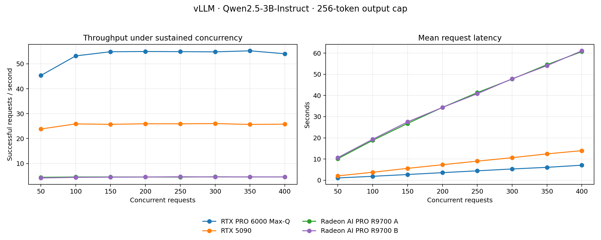

# Case study: inference concurrency benchmarking

## Executive summary

I benchmarked OpenAI-compatible vLLM endpoints across four individual GPU endpoints to find the throughput/latency tradeoff for a realistic cybersecurity-generation request. The RTX PRO 6000 Max-Q endpoint reached the highest measured throughput: 55.23 requests per second at concurrency 350, with 6.07-second mean latency and no recorded failures.

The result applies only to the tested model, prompt, output limit, runtime, and endpoint configuration. It is capacity-planning evidence, not a universal hardware ranking.

## Method

- Model: `Qwen/Qwen2.5-3B-Instruct`
- Endpoint runtime: vLLM
- Request: one security-control Q&A generation prompt
- Prompt size: approximately 600–700 tokens in the historical test
- Maximum output: 256 tokens
- Sustained load: 60 seconds per concurrency level
- Concurrency levels: 50 through 400 in increments of 50
- Metrics: successful requests/second, requests/hour, mean latency, and failures

The historical harness maintained the target number of in-flight requests. The sanitized implementation in [`src/benchmarking/openai_compatible.py`](../src/benchmarking/openai_compatible.py) additionally reports p50, p95, p99, and output-token throughput and contains no private IP addresses.

## Results

| Endpoint hardware | Best tested concurrency | Requests/s | Mean latency | Failures |
|---|---:|---:|---:|---:|
| RTX PRO 6000 Max-Q | 350 | 55.23 | 6.07 s | 0 |
| RTX 5090 | 300 | 26.02 | 10.62 s | 0 |
| Radeon AI PRO R9700 endpoint A | 300 | 4.66 | 47.75 s | 0 |
| Radeon AI PRO R9700 endpoint B | 250 | 4.67 | 40.84 s | 0 |

## Interpretation

- The RTX PRO 6000 Max-Q saturated near 55 requests/second from concurrency 150 onward. Increasing concurrency beyond that mostly increased latency.
- The RTX 5090 plateaued near 26 requests/second. Its reported “best” point was only slightly above neighboring measurements and should not be overfit.
- The two Radeon endpoints plateaued near 4.6 requests/second under the tested ROCm/vLLM stack. This cannot isolate hardware from software maturity, kernel selection, quantization, clocks, or server configuration.
- Zero HTTP failures does not establish output correctness, server health under multi-hour load, or recovery behavior.

For an interactive service I would select concurrency from a latency service-level objective, not maximum throughput alone. For offline batch generation, the higher-throughput operating point may be acceptable.

## Improvements to the next experiment

1. Record exact vLLM, driver, CUDA/ROCm, model revision, dtype, and launch arguments.
2. Warm each endpoint and repeat every level several times in randomized order.
3. Capture prompt tokens/second, output tokens/second, time to first token, and inter-token latency.
4. Measure GPU utilization, VRAM, temperature, clock, power, and CPU saturation.
5. Use identical model artifacts and decoding settings across endpoints.
6. Report confidence intervals and retain raw request-level measurements.
7. Separate interactive latency tests from offline batch-throughput tests.

## Portfolio takeaway

The operational lesson is that **concurrency is an empirical control knob**. A larger queue can raise aggregate throughput, but after saturation it mainly transfers delay to users. Good capacity planning preserves both curves and chooses an operating point based on the mission workload.

