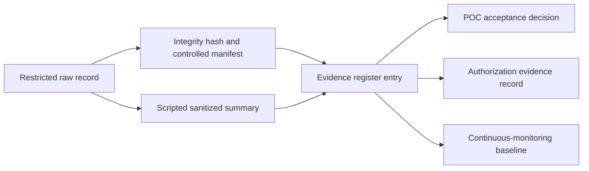

# Case study: converting POC measurements into authorization evidence

## Problem

An AI POC can generate impressive charts and still leave an authorization team with little usable evidence. A performance number without a system manifest, a loss curve without a leakage analysis, or a successful run without an integrity trail cannot support a bounded risk decision.

I revisited the retained project artifacts and applied an evidence-first rule: **execution records outrank plans, public claims stay narrower than their source evidence, and every gap remains visible.**

## Triage result

| Artifact | Defensible public claim | Status | Authorization value |
|---|---|---|---|
| trainer state at step 465,000 | configuration, progress, loss history, runtime, resumable state | verified | configuration, integrity, recovery, evaluation planning |
| retained dataset split metadata | 5,037,282 rows with exact seeded 80/10/10 counts | verified with limitation | data inventory and leakage-risk identification |
| full and seeded evaluation logs | 34,271.6 versus 341.9 seconds at similar sample rate | verified | tiered continuous-evaluation design and capacity estimate |
| timestamped recovery log | 400,163 records loaded; final 100,045-record tranche completed; five errors recorded | verified aggregate | restart, reconciliation, error and continuity evidence |
| 1,073-item generation summary | successful-call count, runtime, and aggregate token rates | partially verified | workload sizing; requires current model/hardware manifest |
| historical GPU partition test | three logical partitions enumerated with 48/24/24 GB | partially verified | inventory feasibility only; isolation and workload tests remain |
| historical inference table | reported concurrency curve and a 55.23 request/s peak | historical / rerun required | defines the rerun hypothesis, not current capacity |
| monitoring script | intended telemetry and failure checks | implementation only | candidate test procedure; no executed monitoring claim |

## Sanitization decisions

The public derivative excludes raw agency implementation records, prompts and outputs, private IP and MAC addresses, hostnames, device UUIDs, machine paths, credentials, model weights, and authorization artifacts. Restricted sources are described generically in the evidence register; the public repository does not reveal their storage locations.

Sanitization also applies to claims. The approximately 100-fold evaluation improvement is described as reduced evaluation scope, not faster inference. Random row splitting is disclosed as a leakage risk. The concurrency table is labeled rerun required because a polished chart cannot replace missing request-level data.

## Evidence pattern

The machine-readable [`../evidence/evidence-register.yaml`](../evidence/evidence-register.yaml) gives each claim an identity, state, sensitivity, public artifact, source description, limitation, and proposed reuse. The controlled agency copy can extend the same schema with storage locators, hashes, reviewers, requirement mappings, and retention dates.

## What the next dual-GPU rerun should produce

The next on-premises POC should bind the current sanitized server manifest, model and container digests, launch configuration, prompt-suite version, acceptance thresholds, request-level results, system telemetry, integrity manifest, deviations, and reviewer disposition into one evidence bundle. Separate load, soak, restart, rollback, degraded-capacity, safety, and mission-quality tests prevent a single throughput chart from standing in for system evaluation.

## Portfolio takeaway

This demonstrates more than model training or GPU benchmarking. It shows the ability to turn imperfect experimental history into honest claims, identify missing evidence, design a reproducible evaluation, protect sensitive source material, and build artifacts that engineering, governance, security, and authorization teams can review together.
