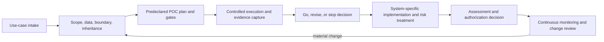

# Authorization evidence map

## How to use this map

This map links engineering evidence to an agency authorization workflow. It is deliberately control-catalog neutral: the system owner and security team map evidence to the agency-selected baseline, overlays, implementation statements, and assessment procedures. The same file may support more than one determination, but a benchmark result is never a substitute for a control implementation or assessor test.

The approach follows the lifecycle orientation of [NIST SP 800-37 Rev. 2](https://csrc.nist.gov/pubs/sp/800/37/r2/final), control-assessment evidence concepts in [NIST SP 800-53A Rev. 5](https://csrc.nist.gov/pubs/sp/800/53/a/r5/final), and AI risk activities in the [NIST AI RMF](https://www.nist.gov/itl/ai-risk-management-framework). Agency policy and the authorizing official's direction are authoritative for the actual package.

## Evidence domains

| Domain | POC evidence | Authorization reuse | Primary owner | Current public example |
|---|---|---|---|---|
| Purpose and scope | use-case intake, users, prohibited uses, decision statement | system description, operating context, risk framing | system/mission owner | POC plan |
| Boundary and architecture | components, interfaces, trust zones, external flows | boundary narrative, diagrams, inventory | architect/system owner | reference architecture |
| CCP inheritance | provider, inheritable service, condition, consumer responsibility | common-control inheritance matrix | CCP + system security lead | template only |
| Asset and model provenance | model source, revision, digest, license, scan, approval | component inventory, supply-chain record, configuration baseline | model custodian | registry template |
| Data governance | categories, source, authority, minimization, retention, split method | data-flow, privacy, records, protection requirements | data/privacy owners | dataset card |
| Access and interfaces | identities, roles, API paths, service accounts, session behavior | access-control and interface implementation/assessment | application owner | implementation only |
| Security and safety testing | injection, disclosure, unsafe action, artifact integrity | risk assessment, test results, findings and remediation | test lead/security | evaluation plan |
| Mission effectiveness | frozen suite, baseline, rubric, reviewer scores | intended-use support and residual-risk decision | mission/evaluation lead | not yet executed |
| Performance/reliability | load, soak, restart, degraded mode, resource telemetry | capacity, contingency, availability and monitoring evidence | platform owner | historical rerun required |
| Logging and monitoring | event catalog, alert tests, access/retention, time sync | assessment evidence and continuous monitoring plan | SOC/system owner | implementation only |
| Recovery and integrity | checkpoint/backup restore, hashes, rollback | contingency and integrity evidence | platform owner | sanitized recovery summary |
| Risk and decisions | finding, likelihood/impact, owner, due date, disposition | risk register, remediation plan, authorization decision input | risk/system owner | risk template |

## Inherited, shared, and system-specific evidence

| Responsibility type | What must be demonstrated |
|---|---|
| Inherited | the CCP service is authorized or otherwise accepted for inheritance; the consumer meets its stated conditions; the inherited status is current |
| Shared/hybrid | the provider and consumer portions are separately named; interfaces and evidence show the combined implementation works |
| System-specific | the application team documents, implements, tests, and monitors the component, model, data, interface, and process |

Physical location inside an existing boundary is useful context, not sufficient evidence of inheritance or authorization. The new system still needs a defined boundary, responsible owner, data and model inventory, applicable requirements, implemented protections, assessed evidence, accepted residual risk, and ongoing monitoring appropriate to the agency process.

## Evidence quality rules

An assessment-ready record should answer: what claim was tested, against which acceptance criterion; on which exact version and configuration; by whom and when; using what procedure and sample; where the raw evidence and integrity hash reside; what passed or failed; what limitations or deviations exist; who reviewed it; and what risk or requirement it supports.

Use [`../templates/authorization-evidence-record.md`](../templates/authorization-evidence-record.md) for each material claim. Link rather than duplicate source evidence so an update has one authoritative location.

## Lifecycle handoff

Model, dataset, prompt policy, runtime, dependency, hardware, interface, mission use, or external-connectivity changes should be screened for reassessment under the agency's configuration and continuous-monitoring process.

## Related federal references

- [NIST SP 800-53 Rev. 5, Update 1](https://csrc.nist.gov/pubs/sp/800/53/r5/upd1/final)
- [NIST SP 800-53A Rev. 5](https://csrc.nist.gov/pubs/sp/800/53/a/r5/final)
- [NIST AI RMF Playbook](https://www.nist.gov/itl/ai-risk-management-framework/nist-ai-rmf-playbook)
- [NIST Generative AI Profile, AI 600-1](https://nvlpubs.nist.gov/nistpubs/ai/NIST.AI.600-1.pdf)
- [OMB M-25-21](https://www.whitehouse.gov/wp-content/uploads/2025/02/M-25-21-Accelerating-Federal-Use-of-AI-through-Innovation-Governance-and-Public-Trust.pdf)
- [OMB M-25-22](https://www.whitehouse.gov/wp-content/uploads/2025/02/M-25-22-Driving-Efficient-Acquisition-of-Artificial-Intelligence-in-Government.pdf?categoryid=2826672)
