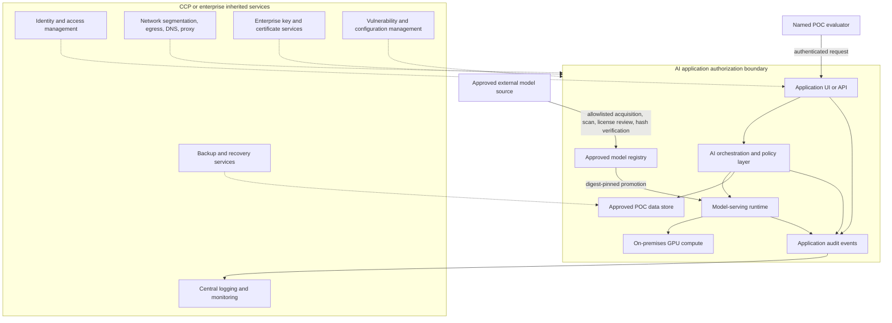

# Reference architecture and authorization boundary

This conceptual architecture shows an agency-hosted AI workload consuming inherited CCP services. Replace every placeholder with the agency-approved component, trust zone, interface, owner, and control implementation before assessment.

## Trust and data flows

| Flow | Data | Required evidence |
|---|---|---|
| User to application | identity, prompt, task metadata | authentication/authorization test, TLS/configuration evidence, logging test |
| Orchestrator to serving runtime | formatted prompt, model/config ID | interface definition, least-privilege path, timeout and error handling |
| Registry to serving runtime | model artifact and manifest | source, license, digest, scan, approval, immutable version, rollback test |
| Components to monitoring | security, performance, and model events | event catalog, time sync, access, retention, alert and incident test |
| External source to registry | model/dependency files | egress approval, allowlist, malware/supply-chain checks, transfer record |
| Application to data store | approved input/output/evaluation data | categorization, owner approval, encryption, access, retention and deletion test |

## Responsibility split

The CCP evidence should identify which services and protections are inheritable, their conditions, and their assessment status. The application team must show that inheritance applies to this consumer and must implement the remaining application-, model-, interface-, data-, and operational responsibilities. Shared protections require both sides to be explicit; an inherited network service, for example, does not prove application authorization, model provenance, safe output handling, or correct audit-event generation.

Use [`authorization-evidence-map.md`](authorization-evidence-map.md) to convert this diagram into a responsibility and evidence matrix.
